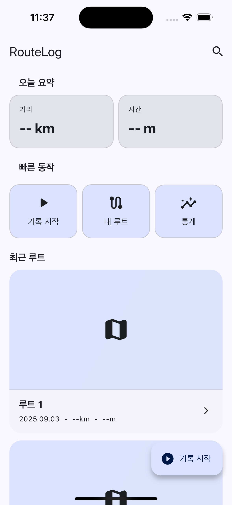
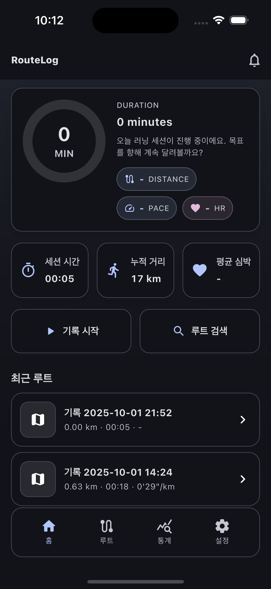
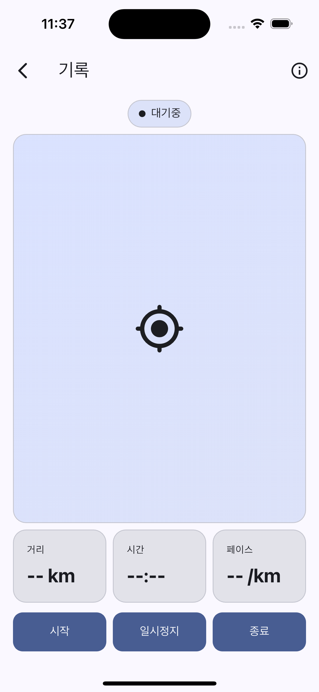
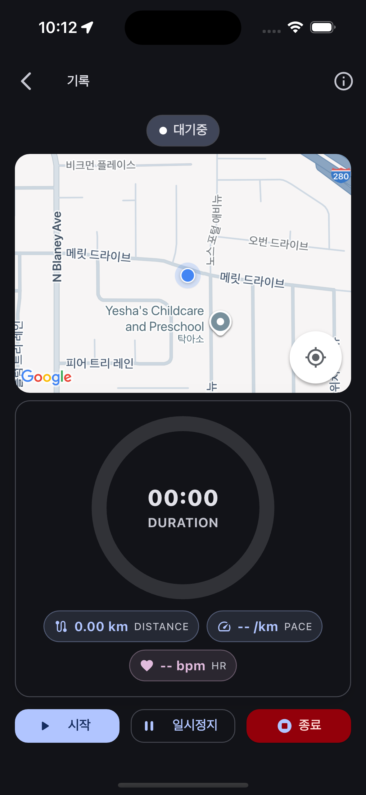
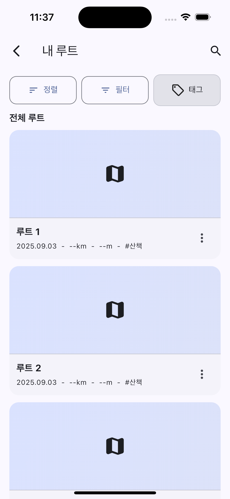
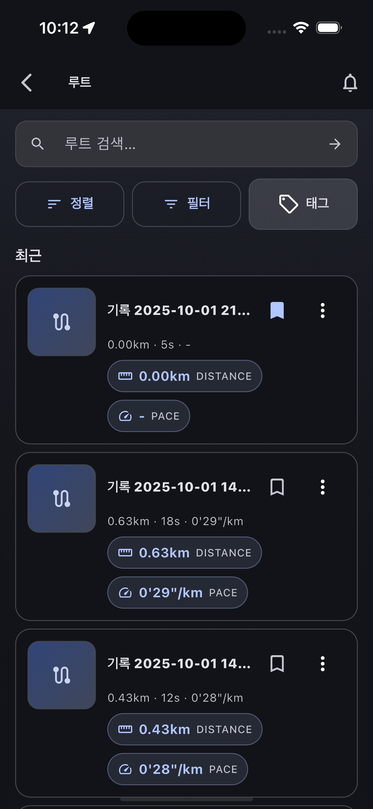
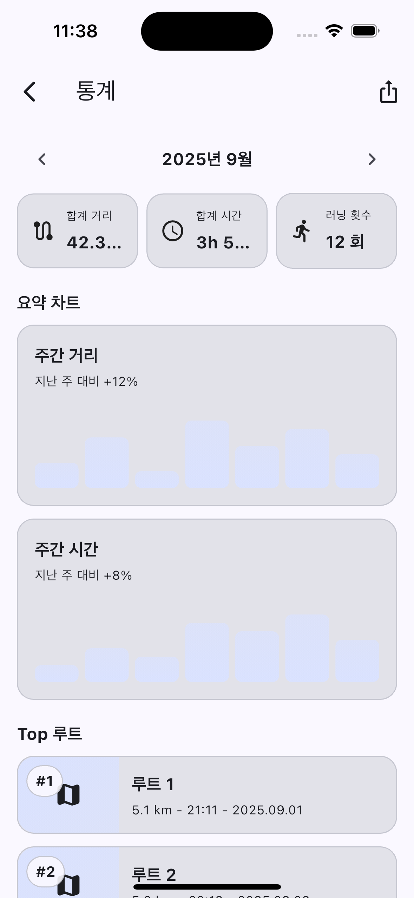
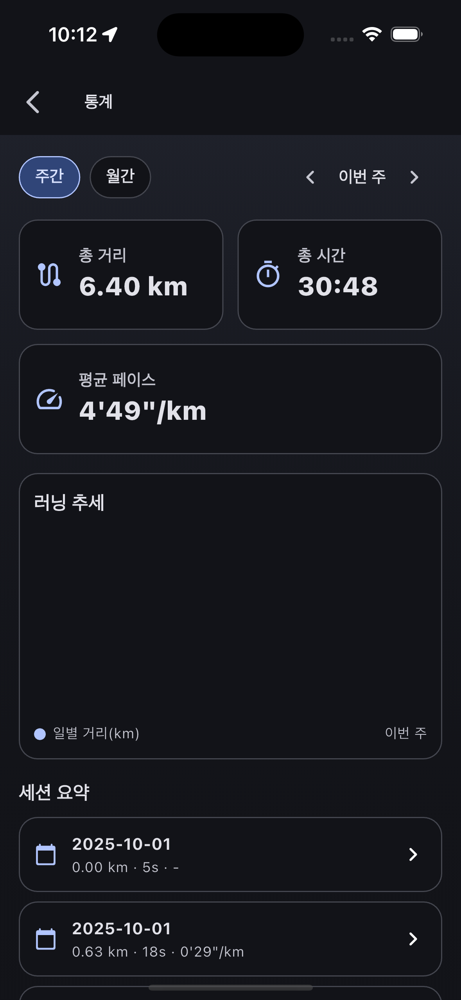

# RunningRoute_Project
러닝/워킹 루트 기록 앱. **GPS로 경로 추적**, **거리/시간/페이스 통계**, **루트 리스트/상세/검색**, **라이트/다크 테마** 지원.

> iOS 최소 13.0. 현재 Firebase는 제외 상태(추가 예정 시점에 재설정).

---

## 📸 스크린샷 (목업 vs 최종본)

| 화면 | 목업(Mock) | 최종본(Final) |
|---|---|---|
| **Home** |  |  |
| **Record** |  |  |
| **Routes** |  |  |
| **Stats** |  |  |

---

## 🎥 시연 영상

[시연 영상 보러가기](docs/img/demo_crf.mp4)

---

## ✨ 주요 기능
- 실시간 경로 기록(시작/일시정지/종료) + 지도 렌더링
- 이동 거리, 시간, 평균 페이스 등 기본 메트릭 표시
- 루트 리스트/필터/정렬 및 상세 화면 골격 구성
- 홈: 요약 카드, 퀵 액션, 최근 루트 섹션
- 통계: 월 선택 바, 주간 거리 미니 차트 등 UI 목업
- 설정: 테마(시스템/라이트/다크) 등 앱 환경 옵션
- 일관된 카드/섹션 컴포넌트, 빈/에러/스켈레톤 상태 컴포넌트

---

## 🧩 기술 스택
-  / Material 3
-  / (CocoaPods 통합 완료: *Flutter*, *shared_preferences_foundation*)
- 현재 **Firebase 제외** 상태 (향후 추가 예정)

### pubspec 주요 의존성
- `cupertino_icons`: ^1.0.8
- `geolocator`: ^14.0.2
- `google_maps_flutter`: ^2.13.1
- `intl`: ^0.20.2
- `path_provider`: ^2.1.5
- `permission_handler`: ^12.0.1
- `shared_preferences`: ^2.2.2

---

## 🔑 지도 API 키 & 권한 설정

### iOS — `ios/Runner/Info.plist`
```xml
<!-- Google Maps API Key -->
<key>GMSApiKey</key>
<string>YOUR_IOS_GOOGLE_MAPS_API_KEY</string>

<!-- 위치 권한 -->
<key>NSLocationWhenInUseUsageDescription</key>
<string>현재 위치를 기반으로 경로를 기록하고 지도를 표시합니다.</string>
<!-- 백그라운드 추적 필요 시 추가 -->
<key>NSLocationAlwaysAndWhenInUseUsageDescription</key>
<string>앱이 백그라운드에서도 경로 기록을 계속하기 위해 위치 접근이 필요합니다.</string>
<key>UIBackgroundModes</key>
<array>
  <string>location</string>
</array>
```

### Android — `android/app/src/main/AndroidManifest.xml`
```xml
<manifest ...>
  <application ...>
    <!-- Google Maps API Key -->
    <meta-data
      android:name="com.google.android.geo.API_KEY"
      android:value="YOUR_ANDROID_GOOGLE_MAPS_API_KEY"/>
  </application>

  <!-- 위치 권한 -->
  <uses-permission android:name="android.permission.ACCESS_FINE_LOCATION" />
  <uses-permission android:name="android.permission.ACCESS_COARSE_LOCATION" />
  <!-- 백그라운드 추적 필요 시 -->
  <uses-permission android:name="android.permission.ACCESS_BACKGROUND_LOCATION" />
</manifest>
```

---

## 🗃️ 데이터 모델(초안)

**Session**
| 필드 | 타입 | 설명 |
|---|---|---|
| id | String | 세션 ID |
| startedAt | DateTime | 시작 시각 |
| endedAt | DateTime? | 종료 시각 |
| distanceMeters | double | 총 거리 |
| durationSec | int | 총 시간(초) |
| avgPace | double | 분/킬로 pace 등 표시용 |

**TrackPoint**
| 필드 | 타입 | 설명 |
|---|---|---|
| sessionId | String | 세션 참조 |
| lat | double | 위도 |
| lng | double | 경도 |
| ts | DateTime | 타임스탬프 |
| accuracy | double? | 정밀도(선택) |

---

## 📱 화면 흐름(요약)
- **Home** → 요약/퀵액션/최근 루트  
- **Record** → 현재 위치 + polyline 실시간 경로 기록  
- **Routes** → 목록/필터/정렬 → 상세(지도/메트릭)  
- **Stats** → 월별/주간 지표 요약(차트 고도화 예정)  
- **Settings** → 테마/기타 환경

---

## ⚠️ 심사/권한 가이드(짧게)
- **iOS**: 백그라운드 위치 사용 시 `UIBackgroundModes: location`과 명확한 목적 문구 필요.  
- **Android**: `ACCESS_BACKGROUND_LOCATION`은 별도 런타임 동의 플로우 필요(정말 필요한 경우에만).  
- **문구**: “경로 기록/운동 기록 목적” 명확히 고지.

---

## 🧭 브랜치
- `main`: 안정 상태
- `develop`: 작업 기본 브랜치
- `design`: 디자인 폴리시/마감 전 시각 보정

### 브랜치 네이밍(권장)
- `feature/record-storage` — 기록 세션 로컬 저장  
- `feature/stats-charts` — 통계 계산 + 차트  
- `chore/release-prep` — 스토어용 아트워크/가이드/버전

---

## 🛣️ 로드맵(요약)
- [x] UI 모형/테마/레이아웃 정리
- [x] 라우트 리스트/상세 기본 골격
- [x] 기록 화면 기본 인터랙션(시작/정지/종료) UI
- [x] 위치 권한/정확도/백그라운드 정책 정리
- [x] 지도 SDK 확정(요금/제한 검토) 및 연동
- [ ] 기록 세션 저장/불러오기(로컬 → 백엔드 확장)
- [ ] 통계 지표 계산/차트 고도화
- [ ] 테스트/릴리즈 준비

---

## 🙌 기여
- 개인 프로젝트이므로 외부 기여는 현재 받지 않음(변경될 수 있음).

---
